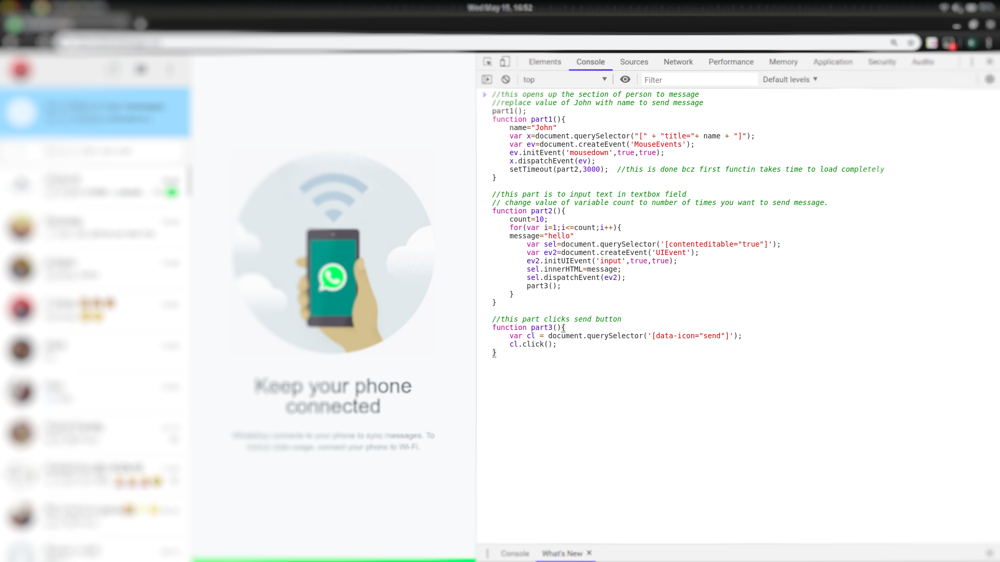

# Whatsapp_spam
This is a script written in JS to send as many number of messages as you want to any of your whatsapp contacts with just a single click. :stuck_out_tongue_winking_eye:

# Usage

  1.Open Whatsapp web and scan QR code.  
  2.Now copy script given above(script.js).  
  3.In web open dev tools (F12) and paste the script in console.  
  4.Change name variable in script from "John" to name of person you want to send messages.  
  5.Also change message and count variable (number of times you want to send message).  
  6.Now press enter to run the script and see the results.:stuck_out_tongue_closed_eyes:  

